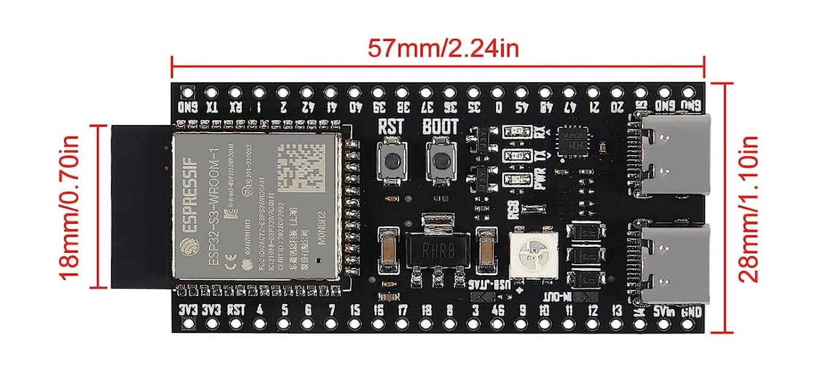

# Retro-Go Pro

A custom handheld build based on [ducalex/retro-go](https://github.com/ducalex/retro-go), the open-source firmware powering most ESP32 retro handhelds. This fork adds a built-in ROM store, extra emulator cores and ports, faster emulation, and a handful of control/UI tweaks.

For the full feature set, supported hardware list and general documentation, see the original repo: **https://github.com/ducalex/retro-go**

## What's New

- **Faster SNES** (`snes-go`): performance improvements
- **Faster Neo Geo Pocket** (`ngp-go`): performance improvements
- **GBA dynarec:** `gbsp` now uses the dynamic recompiler from [pjcau/retro-go](https://github.com/pjcau/retro-go), for a big boost in GBA performance
- **Arcade support:** added `mame-go`, ported from [pjcau/retro-go](https://github.com/pjcau/retro-go)
- **USB DAC audio option** for the [ESP32-S3-DevKitC-1 v1.1](https://docs.espressif.com/projects/esp-dev-kits/en/latest/esp32s3/esp32-s3-devkitc-1/user_guide_v1.1.html) (see [USB DAC Audio](#usb-dac-audio))
- **[Retro-Go Assistant](https://github.com/pcgamer404/Retro-go-Assistant):** a Windows GUI for building, flashing and monitoring (see below)

## Highlights

- Built-in **ROM Store**: browse and download games directly on-device
- **Turbo-fire** and **combo button** controls
- Simplified **ROM art** placement (drop art right next to your ROMs)
- Extra emulator cores and game ports beyond stock retro-go
- Optional **USB DAC audio** output for the ESP32-S3-DevKitC-1

## Supported Systems

**Nintendo**: NES, SNES, GB, GBC, GBA (dynarec), Game & Watch

**Sega**: Game Gear, Master System, Genesis, SG-1000

**Atari**: Lynx, 2600

**Arcade**: MAME (`mame-go`)

**Other**: MSX, PC Engine, ColecoVision, WonderSwan, Neo Geo Pocket (+ Color), Commodore 64, PICO-8 *(slow)*

## Ports

DOOM, Wolfenstein 3D, Duke Nukem 3D, Celeste Classic (PICO-8 port), Outrun, ClassiCube (open-source Minecraft clone), OpenLara (Tomb Raider), Super Mario 64 *(very slow)*, The Oregon Trail

> **Note:** Ports require your own legally obtained game files. None are included.

## Retro-Go Assistant


[**Retro-Go Assistant**](https://github.com/pcgamer404/Retro-go-Assistant) is a Windows GUI around `rg_tool.py`, so you don't need an ESP-IDF terminal:

- Detects apps and targets automatically from this project
- One-click Build, Build + Flash, Build Image, Flash, Full-Image flash and Clean
- Built-in serial monitor with full boot logs, auto baud and crash decoding
- Finds and uses your ESP-IDF environment for you

Drop `retro_go_assistant.py` (or the built `.exe`) next to `rg_tool.py` and run it. Full details are in its repo.

## Additional Features

### ROM Store

Browse and download ROMs directly from the device menu.

1. Set up your own backend using [pcgamer404/RG-Store-Backend](https://github.com/pcgamer404/RG-Store-Backend)
2. Set your store URL in `components/retro-go/targets/<device>/config.h`:
   ```c
   #define RG_STORE_BASE_URL "https://your-store-url.example.com"
   ```

### USB DAC Audio

An optional **USB DAC** audio output, aimed at the [ESP32-S3-DevKitC-1 v1.1](https://docs.espressif.com/projects/esp-dev-kits/en/latest/esp32s3/esp32-s3-devkitc-1/user_guide_v1.1.html) dev board. It lets that board produce sound through a USB DAC instead of dedicated audio hardware.

<!-- TODO: add which USB-C port the DAC plugs into and the config.h option that enables it -->

The DevKitC-1 has two USB-C ports (native USB and a USB-UART bridge), so check the [user guide](https://docs.espressif.com/projects/esp-dev-kits/en/latest/esp32s3/esp32-s3-devkitc-1/user_guide_v1.1.html) for which one is which.



### Minor Improvements

- **Select + Start** opens the menu
- Added **turbo** A (X) and B (Y) buttons for NES games
- **ROM art** can be placed directly in the `roms` folder alongside the ROM

  **Priority order:** `roms folder` → `romart folder` → CRC-based art

  Art file names must match the ROM file name (e.g. `game1.nes` → `game1.png`). For romart dimensions and format, see [ducalex/retro-go](https://github.com/ducalex/retro-go).

## Hardware

### Pinout: Buttons

Configured in `components/retro-go/targets/<device>/config.h`:

| Button | GPIO | Pull-up | Active Level |
|---|---|---|---|
| Up | GPIO_NUM_8 | Yes | LOW |
| Down | GPIO_NUM_6 | Yes | LOW |
| Left | GPIO_NUM_7 | Yes | LOW |
| Right | GPIO_NUM_15 | Yes | LOW |
| Select | GPIO_NUM_5 | Yes | LOW |
| Start | GPIO_NUM_2 | Yes | LOW |
| A | GPIO_NUM_47 | Yes | LOW |
| B | GPIO_NUM_40 | Yes | LOW |
| Y | GPIO_NUM_21 | Yes | LOW |
| X | GPIO_NUM_1 | Yes | LOW |

### Pinout: Display (SPI)

| Signal | GPIO |
|---|---|
| MISO | Not connected (-1) |
| MOSI | GPIO_NUM_13 |
| CLK | GPIO_NUM_12 |
| CS | GPIO_NUM_10 |
| DC | GPIO_NUM_11 |
| Backlight | GPIO_NUM_14 |
| RST | Not connected (-1) |

### Pinout: SD Card (SPI)

| Signal | GPIO |
|---|---|
| MISO | GPIO_NUM_9 |
| MOSI | GPIO_NUM_13 |
| CLK | GPIO_NUM_12 |
| CS | GPIO_NUM_18 |

> **Note:** Audio and battery-status GPIO are **disabled by default** and must be enabled in the same `config.h` for your board.

## Building & Flashing

Built with **ESP-IDF v5.3.5** using retro-go's own tool, `rg_tool.py`, which wraps `idf.py` to handle the multi-app build (plain `idf.py` can't). Run from the project root, or use the [Retro-Go Assistant](#retro-go-assistant) instead of typing commands.

Set your port and target once with the environment variables `RG_TOOL_PORT` and `RG_TOOL_TARGET`, or pass `--port` / `--target`. See `python rg_tool.py --help` for all flags.

### Default build apps

`nes`, `gb`, `gbc`, `gw` (Game & Watch), `gg` (Game Gear), `sms` (Master System), `lynx`, `colecovision`, `pce` (PC Engine), `celeste`, `openlara`, `cannonball`, `classicube`, `ngp-go` (Neo Geo Pocket). Others, such as `gbsp` and `mame-go`, can be added by name.

### Build commands

```bash
# Flashable .img (serial flash)
python rg_tool.py --target=my-handheld build-img

# .fw (SD-card firmware update file)
python rg_tool.py --target=my-handheld build-fw

# Specific apps only
python rg_tool.py --target=my-handheld build-img launcher nes doom

# Clean release build
python rg_tool.py --target=my-handheld release
```

### Flashing

```bash
# One app (fast, skips repackaging)
python rg_tool.py --target=my-handheld --port=COM3 flash nes

# Several apps
python rg_tool.py --target=my-handheld --port=COM3 flash launcher nes doom celeste

# Flash, then open the serial monitor
python rg_tool.py --target=my-handheld --port=COM3 run nes

# Full .img directly with esptool
esptool.py --chip esp32s3 --port COM3 --baud 921600 write_flash --flash_size detect 0x0 build/retro-go_my-handheld.img
```

> On Windows, `./rg_tool.py ...` may pick the wrong Python. Use `python rg_tool.py ...`.

## Credits

- [ducalex](https://github.com/ducalex) and contributors: original [retro-go](https://github.com/ducalex/retro-go) firmware
- [pjcau](https://github.com/pjcau/retro-go): GBA dynarec (`gbsp`) and `mame-go`
- [DynaMight1124](https://github.com/DynaMight1124): new ports and emulators
- [pcgamer404](https://github.com/pcgamer404): [RG-Store-Backend](https://github.com/pcgamer404/RG-Store-Backend) and [Retro-Go Assistant](https://github.com/pcgamer404/Retro-go-Assistant)
- All upstream emulator core and port authors
